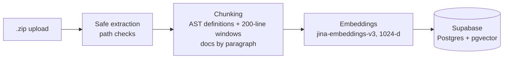
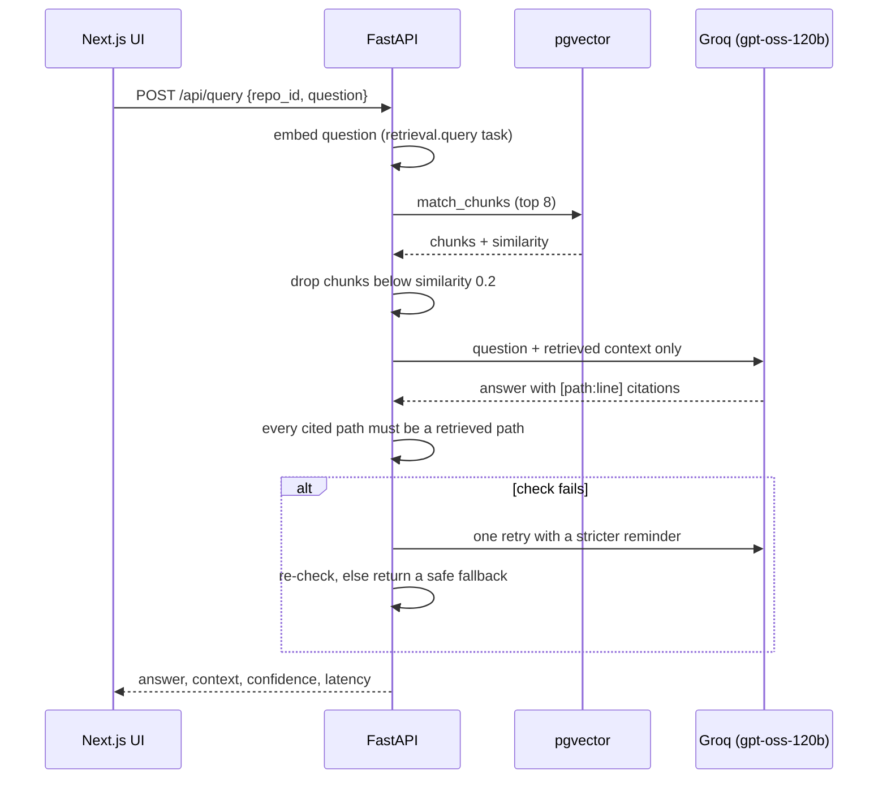

# Signal

**Ask your codebase. Verify every answer.**

Signal is an AI workspace that answers questions about a repository and cites the exact file and lines behind every claim. Upload a `.zip`, wait for indexing, and ask. Click any citation to read the real source, scrolled to the cited lines.

<!-- Add your screenshots to docs/screenshots/ before pushing -->


## Why it's different

Most "chat with your code" demos ask you to trust the model. Signal is built so you don't have to:

- **Citations are checked, not trusted.** After the model answers, Signal verifies that every file it cites was actually retrieved for that question. A failed check triggers one stricter retry, then a safe fallback instead of an unverified answer.
- **Honest confidence.** The badge is the similarity of the best-matching code chunk, not an invented accuracy score. It turns teal only above 90%.
- **One click to the source.** Citations open the real file at the cited lines, with syntax highlighting.
- **Structure-aware retrieval.** Code is chunked by function, class and method using tree-sitter, not by arbitrary character counts.

## How it works





## Engineering decisions

| Decision                                                             | Why                                                                                                                                |
| -------------------------------------------------------------------- | ---------------------------------------------------------------------------------------------------------------------------------- |
| Two chunk sets: AST definitions **and** 200-line windows             | Definitions give precise answers for named functions; windows catch module-level code the AST pass misses.                         |
| Asymmetric embeddings (`retrieval.passage` vs `retrieval.query`)     | The model is trained so questions and code live near each other in vector space.                                                   |
| Validate cited **paths** against retrieved chunks                    | Cheap, deterministic guard against invented files. It does not verify line numbers or that a claim is semantically right.          |
| Normalize full-width brackets in model output                        | The model reliably emitted `【path:line】` despite instructions, so output is normalized to ASCII before validation and display.   |
| File preview resolves the path, then checks it stays inside the repo | Filtering `..` strings is bypassable. Resolving first handles traversal, absolute paths and symlinks. Covered by `apps/api/tests`. |
| Status polling stops itself                                          | `refetchInterval` returns `false` on `indexed`/`failed`, so no timers leak.                                                        |
| Server state in TanStack Query, UI state in Zustand                  | Different lifetimes and failure modes; mixing them causes stale-state bugs.                                                        |

## Tech stack

- **Interface:** Next.js 16, React 19, TypeScript, Tailwind CSS v4, TanStack Query, Zustand
- **Backend:** FastAPI, Python, tree-sitter
- **AI and data:** Jina embeddings v3, Groq (`openai/gpt-oss-120b`), Supabase (Postgres + pgvector)

## Repository layout

```
apps/
  api/                 FastAPI service
    app/routes/        ingest, repos (+ file preview), query, health
    app/services/      parser, chunker, embedder, indexer, answering
    sql/schema.sql     database schema (see note inside)
    tests/             security tests for the file-preview endpoint
  web/                 Next.js app
    app/               landing page (/) and workspace (/workspace)
    components/        chat, code viewer, landing, workspace shell, ui
    hooks/ lib/ store/ data layer, utilities, UI state
```

## Getting started

**Prerequisites:** Node 20+, Python 3.12+, a Supabase project, a Groq API key, a Jina API key.

### 1. Database

Open the Supabase SQL editor and run `apps/api/sql/schema.sql`.

### 2. API

```bash
cd apps/api
python -m venv .venv && source .venv/bin/activate   # Windows: .venv\Scripts\activate
pip install -r requirements.txt
cp .env.example .env                                  # then fill in the values
uvicorn app.main:app --reload
```

| Variable                                    | Purpose                                                               |
| ------------------------------------------- | --------------------------------------------------------------------- |
| `SUPABASE_URL`, `SUPABASE_SERVICE_ROLE_KEY` | Database access (server-side only)                                    |
| `GROQ_API_KEY`                              | Answer generation                                                     |
| `JINA_API_KEY`                              | Embeddings                                                            |
| `CORS_ORIGINS`                              | Comma-separated allowed web origins (default `http://localhost:3000`) |

### 3. Web

```bash
cd apps/web
npm install
echo "NEXT_PUBLIC_API_URL=http://localhost:8000" > .env.local
npm run dev
```

Open http://localhost:3000.

### Tests

```bash
cd apps/api
pip install -r requirements-dev.txt
pytest
```

## API

| Method   | Path                         | Description                                                            |
| -------- | ---------------------------- | ---------------------------------------------------------------------- |
| `POST`   | `/api/ingest`                | Upload a `.zip` (max 200 MB); extracts, then indexes in the background |
| `GET`    | `/api/repos`                 | List repositories                                                      |
| `GET`    | `/api/repos/{id}/status`     | Poll indexing status                                                   |
| `GET`    | `/api/repos/{id}/file?path=` | Read one source file (path-confined, 1 MB cap)                         |
| `DELETE` | `/api/repos/{id}`            | Delete a repository, its index and files                               |
| `POST`   | `/api/query`                 | Ask a question, get an answer with citations                           |

## Deploying

- **Web (Vercel):** set the project root to `apps/web`. Environment: `NEXT_PUBLIC_API_URL` (your API's HTTPS URL) and `NEXT_PUBLIC_SITE_URL` (your site's URL, used for the share image).
- **API (Render, Railway or Fly):** start with `uvicorn app.main:app --host 0.0.0.0 --port $PORT`. Set the variables above, with `CORS_ORIGINS` set to your web URL. Mount a **persistent disk** at `apps/api/data`: uploaded files live there, and without it the code viewer falls back to the indexed snippet after a restart.
- **HTTPS everywhere:** an HTTPS site cannot call an HTTP API.

## Known limitations

- **No authentication or rate limiting.** Anyone with the URL can upload and query, which spends your API credits. For a public demo, set spend caps with your providers or add limits before sharing widely.
- **Single tenant.** All repositories are visible to everyone using the instance.
- **AST chunking covers Python, JavaScript, TypeScript, TSX and Go.** Other languages fall back to doc-style or no chunking.
- **Citation validation checks file paths only**, not line numbers or factual correctness.
- **The local embedding fallback is optional.** The code can fall back to a local model when the Jina API is unavailable, but `sentence-transformers` is not in `requirements.txt`. Install it yourself if you want that path.
- **Files are stored on local disk**, so horizontal scaling needs shared storage.

## License

Add your license here.
